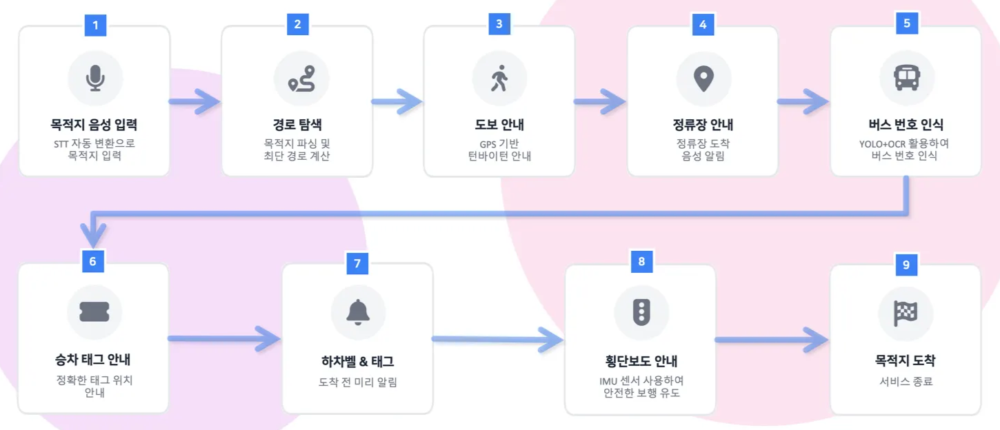
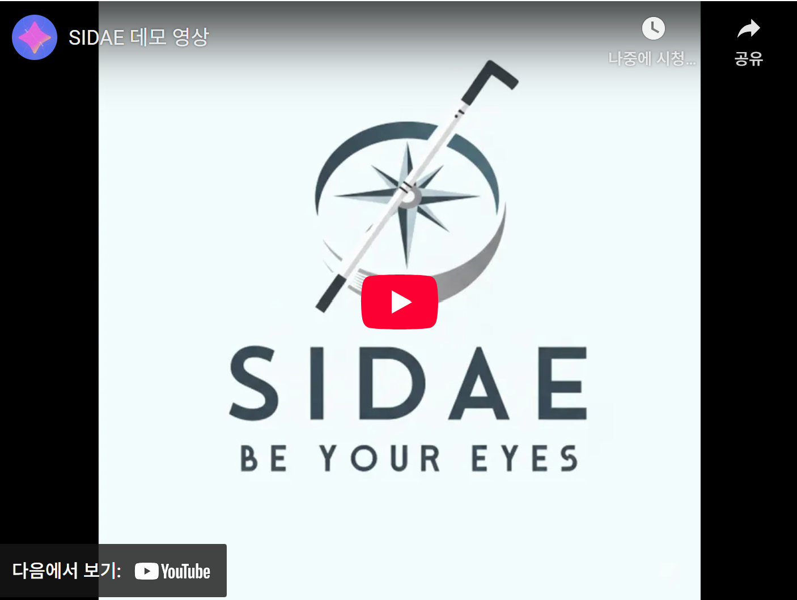
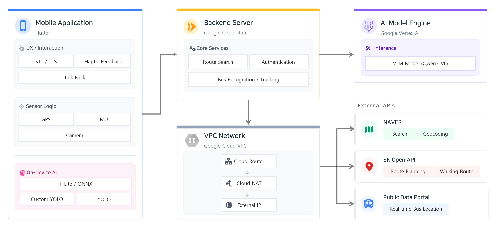

## SIDAE: 시각장애인이 출발지부터 목적지까지 안전하게 이동할 수 있도록  음성 및 진동 중심의 안내를 제공하는 대중교통 서비스

  

## 🚀 프로젝트 소개

시각장애인이 목적지까지 안전하게 이동할 수 있도록 음성 중심의 안내를 제공하는 대중교통 안내 서비스(시대)입니다. 시각장애인의 대중교통 이용이 어렵다는 설문 및 조사 그리고 한국시각장애인협회에 문의한 인터뷰 내용을 바탕으로 문제를 정의하고 해결하고자 했습니다.

### 💡 기획 배경

시각장애인의 대중교통 이용은 단순한 이동 문제가 아니라 **안전**과 **정보 접근성**이라는 두 가지 과제를 안고 있습니다. 경기 연구원의 조사에 따르면, 시각장애인이 가장 이용하기 불편하다고 느끼는 교통수단은 **버스(52.8%)** 로 나타났습니다.

주요 문제로는  
> 1. **버스 번호 및 차량 식별**의 어려움  
> 2. **승·하차 단말기 및 하차벨 위치 인식**의 어려움
> 3. **횡단 및 보행 시 방향·신호 판단**의 어려움이 지적되었습니다.

이에 본 프로젝트는 시각장애인의 안전하고 독립적인 이동을 지원하기 위해, 출발지부터 목적지까지 전 과정을 안내할 수 있는 **End-to-End 대중교통 안내 시스템**을 기획하였습니다.

## 🔄 서비스 플로우

1.  음성으로 목적지 입력 → 최단 경로 탐색 후 안내
2.  도보 이동 → 버스 정류장 도착
3.  버스 번호 인식 후 승차(태그기 위치 설명) 안내 + 탑승 도중 하차벨 및 하차 태그기 위치 안내
4.  버스 하차 후 도보 안내 → 횡단보도 이용 안내
5.  최종 목적지 도착

## 🔍 핵심 AI 서비스
### 1. 버스 번호 인식
- YOLOv11s 기반 버스 탐지 → 탐지 영역 crop → Qwen 3VL 기반 OCR → 버스 번호 및 차량 번호 추출

### 2. 승/하차태그 및 하차벨 안내
- 객체 탐지(tag/bell) → 3×3 grid 기반 위치 판단 → 최적 위치 선택 및 맥락 기반 설명 → 음성 안내

### 3. 횡단보도 안내
- YOLO v11 Small 모델과 신호 처리 알고리즘을 통한 횡단 여부 판단 
- 스마트폰의 IMU 센서와 공간음향 신호를 통한 직관적인 목적지 위치 전달 

### 4. 대화형 상황 인식 VLM Agent
- Tool(버스 정보, 남은 거리, 위치 등 네비게이션 데이터 등 조회)을 활용한 답변 생성
- 이미지, 사용자 프롬프트 기반 답변 생성

## 🎬 시연 영상
> ⚠️ **실제 시각장애인의 사용 환경을 반영하여 음성이 빠르게 재생됩니다.**

  

## ⚙️ 시스템 아키텍쳐

## 📖 문서

- 🎥 [발표 영상](https://www.youtube.com/watch?v=tvr4pffvR90)
- 📄 [Wrap-up 리포트](https://drive.google.com/file/d/1rEiMhh8yiBj4yZR8Q8a5GCDO163vyT1C/view?usp=sharing)

## 👥팀원 소개

|  [김범진](https://github.com/kimbum1018) APP개발&AI리드 |  [김준수](https://github.com/0129jonsu) APP개발&AI서브 |  [김한준](https://github.com/hanjun0126) Backend&AI서브 |  [남현지](https://github.com/yujh5537) Backend&AI서브 |  [송예림](https://github.com/SongYerim) APP개발&AI서브 |
| ------------------------------------------------------------ | ------------------------------------------------------------ | ------------------------------------------------------------ | ------------------------------------------------------------ | ------------------------------------------------------------ |

