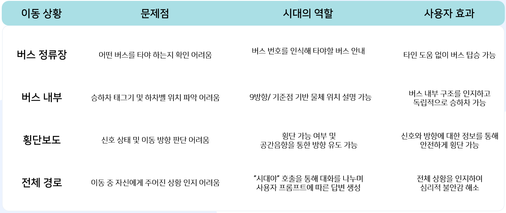
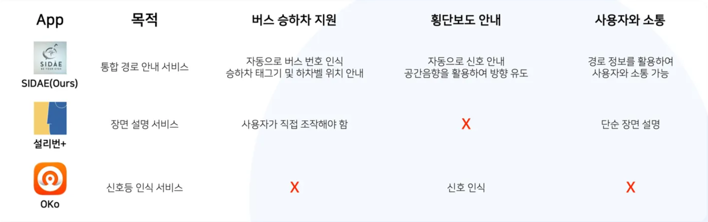

## SIDAE: 시각장애인이 출발지부터 목적지까지 안전하게 이동할 수 있도록  음성 및 진동 중심의 안내를 제공하는 대중교통 서비스

## 1. 프로젝트 소개

시각장애인이 목적지까지 안전하게 이동할 수 있도록 음성 중심의 안내를 제공하는 대중교통 안내 서비스(시대)입니다. 시각장애인의 대중교통 이용이 어렵다는 설문 및 조사 그리고 한국시각장애인협회에 문의한 인터뷰 내용을 바탕으로 문제를 정의하고 해결하고자 했습니다.

## 2. 기획 배경

시각장애인의 대중교통 이용은 단순한 이동 문제가 아니라 안전과 정보 접근성이라는 두 가지 과제를 안고 있습니다. 경기 연구원의 조사에 따르면, 시각장애인이 가장 이용하기 불편하다고 느끼는 교통수단은 **버스(52.8%)**로 나타났습니다.

주요 원인으로는 첫째, 이용하려는 버스 번호를 확인하기 어렵고, 둘째, 승·하차 카드 단말기와 하차벨의 위치를 찾기 어렵다는 점, 셋째, 노선이나 배차 시간 등 핵심 정보를 실시간으로 얻기 어렵다는 점이 지적되었습니다.

본 프로젝트는 시각장애인의 안전하고 독립적인 이동을 지원하기 위해, 출발지부터 목적지까지 전 과정을 안내할 수 있는 End-to-End 대중교통 안내 시스템을 기획하였습니다.

## 3. 서비스 플로우

시대의 서비스 플로우는 다음과 같습니다.

1.  음성으로 목적지 입력 → 최단 경로 탐색 후 안내
2.  도보 이동 → 버스 정류장 도착
3.  버스 번호 인식 후 승차(태그기 위치 설명) 안내 + 탑승 도중 하차벨 및 하차 태그기 위치 안내
4.  버스 하차 후 도보 안내 → 횡단보도 이용 안내
5.  최종 목적지 도착

## 4. 시스템 아키텍쳐

시대는 On-Device AI와 클라우드 서버가 유기적으로 연동되는 하이브리드 API구조로 설계되었습니다. 모바일 애플리케이션은 시각장애인 사용자가 직접 사용하는 영역입니다. Backend 서버는 모든 응답과 요청을 처리하는 영역으로 요청을 바탕을API 정보와 모델의 추론을 결과로 받아옵니다.

## 5. 프로젝트 성과

시대가 해결한 문제와 기대할 수 있는 효과는 다음과 같습니다.

다른 앱과의 목적 및 기능 비교입니다.

## 6. Appendix

데모 영상 링크: https://youtu.be/AlW0Hb4Syug

PPT링크:
Wrap-up리포트 링크: <a href="https://drive.google.com/file/d/1rEiMhh8yiBj4yZR8Q8a5GCDO163vyT1C/view?usp=sharing">Wrap-up 리포트</a>

## 팀원 소개

|  [김범진](https://github.com/kimbum1018) APP개발&AI리드 |  [김준수](https://github.com/0129jonsu) APP개발&AI서브 |  [김한준](https://github.com/hanjun0126) Backend&AI서브 |  [남현지](https://github.com/yujh5537) Backend&AI서브 |  [송예림](https://github.com/SongYerim) APP개발&AI서브 |
| ------------------------------------------------------------ | ------------------------------------------------------------ | ------------------------------------------------------------ | ------------------------------------------------------------ | ------------------------------------------------------------ |

